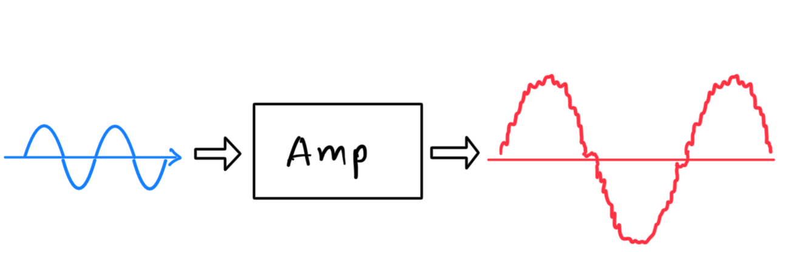

# High-Fidelity-Audio-Amplifier-Design
---

This repository contains the design, simulation, and implementation details for a high-fidelity audio amplifier, developed as a project for the Department of Electronic and Telecommunication Engineering at the University of Moratuwa, Sri Lanka (EN2111). The amplifier is designed for home audio applications, providing clear, distortion-free sound by balancing performance and efficiency.

---

### Project Overview

The project focuses on a **Class AB power amplifier** that aims to deliver optimal audio quality. The system is divided into several key stages:

* **Pre-Amplifier Stage:** This initial stage takes weak audio signals from sources like smartphones or audio players and boosts them to a suitable level for further processing. It uses a non-inverting operational amplifier configuration, specifically the **NE5532 op-amp**, known for its low noise and high fidelity. The gain is adjustable, ranging from 30 to 40, to accommodate various input signal strengths.
* **Tone Control Stage:** This stage provides users with manual control over the audio signal's bass, midrange, and treble frequencies. It incorporates low-pass, band-pass, and high-pass filters, each carefully designed with an NE5532 op-amp to ensure precise tonal adjustments across the audio spectrum. This allows for sound customization based on personal preference or the listening environment.
* **Power Amplifier Stage:** The core of the system is a **Class AB power amplifier**, responsible for driving an 8-ohm, 10-watt speaker. This topology was chosen for its balance of efficiency and linearity, minimizing crossover distortion while maintaining good power efficiency (around 78.5% maximum). The design incorporates complementary transistors (**2SD1047** and **2SB817**) suitable for audio applications, capable of handling the required power dissipation and current. Diodes (**1N4148**) and specific resistor and capacitor values are used for biasing and emitter degeneration to optimize performance.
---
### Pre Amplifier

---
### Tone Controller

---
### Power Amplifier

---

### Features

* **Adjustable Tone Control:** Independent control over bass, midrange, and treble frequencies.
* **Low-Noise Pre-Amplifier:** Ensures clean amplification of weak input signals.
* **Class AB Power Amplification:** Provides high fidelity with efficient power delivery, minimizing distortion.
* **Standard Speaker Compatibility:** Designed to drive 8-ohm speakers.
* **Regulated Power Supply:** Operates on a stable $\pm15V$ supply.
* **Negative Feedback Implementation:** Incorporated to reduce distortion and improve linearity across the full frequency range.
* **Robust Component Selection:** Utilizes high-performance audio-grade components like the NE5532 op-amp and specific power transistors.
---
### PCB
  
  
---

### Implementation and Validation

The amplifier system underwent a comprehensive design and validation process:

* **Circuit Design:** The circuits were designed with a focus on optimal performance for high-fidelity audio.
* **Simulation:** Extensive simulations were conducted using **LTspice** and **Proteus** software to verify circuit functionality, gain ranges, frequency responses, and distortion characteristics. For instance, the pre-amplifier's adjustable gain was confirmed, and the tone control's frequency response was analyzed across different settings. Maximum power dissipation for the power amplifier was calculated using **Maxima**.
* **Prototyping:** The designs were physically implemented on a breadboard to test their real-world performance.
* **Testing and Analysis:** Thorough testing evaluated key parameters such as gain, frequency response (20 Hz – 20 kHz), and output power (10W). **Total Harmonic Distortion (THD)** was a critical metric, with the goal of keeping it below 1%. Detailed analysis of harmonic and crossover distortion was performed, demonstrating how the Class AB topology and biasing techniques minimize these effects. Real-time THD measurements were compared against simulated values, validating the design and identifying areas for practical considerations.
---
### THD Analysis

## Distortion Analysis

In our Hi‐Fidelity Audio Amplifier design, two primary types of distortion are observed at the output stage: **harmonic distortion** and **crossover distortion**.
Harmonic distortion arises whenever the amplifier’s transfer characteristic deviates from perfect linearity, generating frequency components at integer multiples of the input frequency.
Crossover distortion, on the other hand, is inherent to push–pull output stages operating around the zero‐crossing of the waveform; it appears as a small “dead‐zone” near the point where one transistor hands off conduction to its complement.

---

## Harmonic Distortion

Harmonic distortion occurs whenever the amplifier’s active devices (transistors or op‐amps) exhibit nonlinear behavior. In practice, the output voltage $v_{\mathrm{out}}(t)$ can be viewed as a Fourier series expansion:

where:
* $V_1$ is the amplitude of the *fundamental* component at angular frequency $\omega = 2\pi f_{\mathrm{in}}$,
* $V_n$ (for $n \geq 2$) are the amplitudes of the *nth* harmonic components at $n\omega$, and
* $\varphi_n$ are the corresponding phase offsets.

*Figure: Distortion occurring at output*

Because the amplifier is not perfectly linear, energy “leaks” into these higher‐order harmonics $\{2\omega,\,3\omega,\,\dots\}$. The Total Harmonic Distortion (THD) quantifies the ratio of the combined RMS amplitude of all harmonic components to that of the fundamental. By definition,

### Calculation Procedure:
1. *Signal Acquisition:* Apply a pure sinusoidal input of frequency $f_{\mathrm{in}}$ (e.g., $1\,\text{kHz}$) to the amplifier under test and measure the output waveform $v_{\mathrm{out}}(t)$ using a spectrum analyzer or FFT‐capable oscilloscope.
2. *Harmonic Extraction:* Compute (or read off) the amplitudes $V_1,\,V_2,\,V_3,\,\dots$ of the fundamental and the first several harmonics. In practice, harmonics with power less than 30 dB level with respect to the fundamental can be considered as negligible, because higher‐order components are typically negligible.
3. *THD Computation:* Compute
 
4. *Tabulate Results:* Record the measured values $V_1, V_2, V_3, \dots$ and compute THD as above. A low THD (e.g., below $0.1\%$) confirms high fidelity; higher THD indicates more energy in distortion products.

### THD Calculation for Each Band

Across all frequency ranges—60 Hz (bass), 500 Hz and 5 kHz (mid), and 15 kHz (treble)—the real-time THD was slightly higher than simulated values, which is typical due to practical non-idealities such as op-amp limitations, PCB noise, and component tolerances.

This comparison helps validate the simulation model and identify areas for potential improvement in the physical design.

---

### Gain vs. THD

To analyze the distortion behavior of our tone control circuit, we generated two comparative graphs. The first graph, *Gain vs. THD*, illustrates how Total Harmonic Distortion (THD) varies with the gain applied to different frequency bands (bass, mid, treble).

It shows that higher gain settings generally introduce more distortion, especially in the mid-range frequencies. For example, the THD rises to around 17.9% at 500 Hz under a gain of approximately 10 dB.

## Crossover Distortion

Near the zero‐crossing of the input sine wave, both the NPN and PNP output transistors are momentarily *off*, because each transistor requires approximately $V_{\mathrm{BE,on}} \approx 0.7\,\mathrm{V}$ to begin conducting. As a result, the transfer characteristic exhibits a small “notch” or “dead‐band” around $v_{\mathrm{in}} = 0$. In mathematical terms, the output voltage $v_{\mathrm{out}}$ remains at approximately $+0.7\,\mathrm{V}$ or $-0.7\,\mathrm{V}$ until the input exceeds the transistor’s base‐emitter threshold. This nonlinearity creates a distortion component that is especially visible at low output levels, and is referred to as crossover distortion.

To mitigate crossover distortion, we typically:
* Introduce a small bias (often implemented with diodes or a VBE multiplier) that keeps both transistors slightly conducting even when the input is near zero.
* Employ negative feedback around the entire amplifier to “linearize” the crossover region by forcing the output to follow the input more faithfully.

A qualitative sketch of the transfer curve illustrates how, without proper biasing, there is a segment near $v_{\mathrm{in}}=0$ where neither transistor conducts, causing a kink in the output. With adequate bias and feedback, this kink is effectively “filled in,” reducing audible distortion.

---

## Conclusion

Our distortion analysis shows that the dominant harmonic distortion terms arise from device nonlinearities in the input and driver stages, quantified by THD via the formula above. Crossover distortion manifests in the push–pull output stage around the zero‐crossing if biasing is insufficient. In our final amplifier layout, we have minimized both effects employing local feedback loops to reduce harmonics and a VBE‐multiplier bias network to suppress crossover distortion, thus achieving a high‐fidelity output with THD typically below 0.1% under nominal operating conditions.

The project successfully delivers a high-performance audio amplifier, achieving high fidelity output with THD typically below 0.1% under nominal operating conditions by minimizing both harmonic and crossover distortions through careful design choices, including local feedback loops and a VBE-multiplier bias network.

